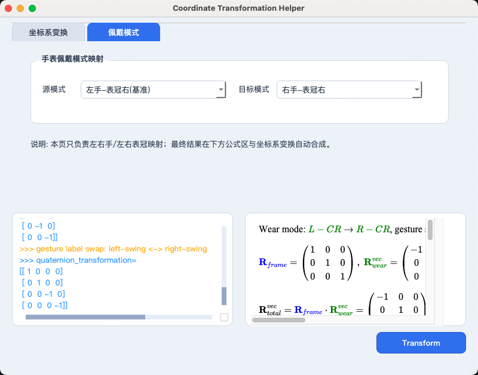

# Coordinate Transformation Helper

Language: **English** | [中文](README.zh.md)

A GUI tool for unifying coordinate and rotation representations.  
It supports two decoupled but composable transforms:

1. **Frame Transform**
2. **Wear Transform** (left/right wrist + crown left/right)

Both are configured in separate tabs and combined automatically when you click `Transform`.

## UI Preview

| Frame Transform Tab | Wear Transform Tab |
|---|---|
|  Configure source/target axis conventions and quaternion order. |  Configure source/target wrist+crown wear modes for watch scenarios. |

## Application Scenarios

### 1) Frame Transform (`坐标系变换` tab)

Use this when source/target coordinate conventions are different (OpenCV/OpenGL/IMU/Unity or custom axis definitions), or when quaternion order differs.

### 2) Wear Transform (`佩戴模式` tab)

Use this when your model/data baseline wear mode differs from runtime wear mode (left/right wrist + crown left/right), especially for watch-based gesture systems.

## Principles

### A. Frame Transform Principle

- Build an orthogonal matrix `R_frame` from axis permutation + sign flips.
- For ordinary vectors (`acc`, position, velocity):
  `v_t = R_frame * v_s`
- For pseudovectors (`gyro`, rotation-axis part):
  `p_t = det(R_frame) * R_frame * p_s`

### B. Wear Transform Principle

- Wrist side switch (left/right) is modeled as mirror:
  `M = diag(-1, 1, 1)`
- Crown side switch is modeled as:
  `C = diag(-1, -1, 1)`
- Ordinary vector uses `R_wear`
- Pseudovector uses `det(R_wear) * R_wear`
- If wrist side changes, gesture semantics should swap:
  `left swing <-> right swing`

## Composition Rule

- `R_total_vec = R_frame * R_wear`
- `R_total_pseudo = det(R_total_vec) * R_total_vec`

Therefore:

- `acc_out = R_total_vec * acc_in`
- `gyro_out = R_total_pseudo * gyro_in`
- Quaternion vector part follows `R_total_pseudo`, while scalar part `q_w` stays unchanged.

## Wear Modes (relative to Left Wrist + Crown Right baseline)

| Wear Mode | `acc` transform | `gyro` transform | Gesture semantics |
|---|---|---|---|
| Left wrist, crown right | `( ax,  ay, az)` | `( gx,  gy,  gz)` | unchanged |
| Left wrist, crown left | `(-ax, -ay, az)` | `(-gx, -gy,  gz)` | unchanged |
| Right wrist, crown right | `(-ax,  ay, az)` | `( gx, -gy, -gz)` | left↔right swing |
| Right wrist, crown left | `( ax, -ay, az)` | `(-gx,  gy, -gz)` | left↔right swing |

## Quick Usage

1. Configure source/target frame in `坐标系变换`.
2. Configure source/target wear mode in `佩戴模式`.
3. Choose quaternion order (`w,x,y,z` or `x,y,z,w`).
4. Click `Transform` and inspect logs + formulas.

## Notes

- UI is decoupled; math is auto-composed.
- Wide logs/formulas can be inspected with horizontal scrolling.
